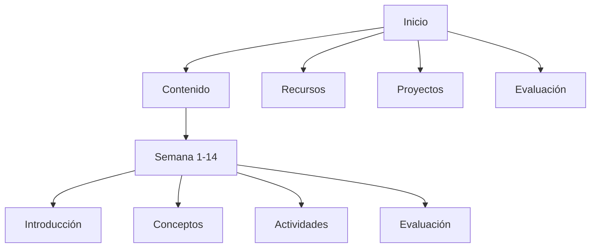

# 📚 Guía de Usuario - Sitio Web de Minería de Datos

Esta guía te ayudará a navegar y utilizar eficazmente el sitio web educativo del curso de Minería de Datos.

## 🎯 Bienvenido al Curso

### ¿Qué es la Minería de Datos?
La minería de datos es el proceso de descubrir patrones, conocimientos e información valiosa a partir de grandes conjuntos de datos utilizando métodos estadísticos, matemáticos y de aprendizaje automático.

### Objetivos del Curso
- Comprender los fundamentos de la minería de datos
- Aprender a manejar herramientas como Python, pandas y scikit-learn
- Aplicar técnicas de análisis y visualización de datos
- Desarrollar proyectos prácticos con datos reales

## 🚀 Primeros Pasos

### 1. Acceso al Sitio Web
1. Abre tu navegador web (Chrome, Firefox, Safari, o Edge)
2. Ingresa la URL proporcionada por tu instructor
3. La página principal se cargará automáticamente

### 2. Requisitos Técnicos
- **Navegador**: Versión actualizada de Chrome, Firefox, Safari o Edge
- **Conexión a Internet**: Estable para videos y contenido interactivo
- **Resolución mínima**: 1024x768 px
- **JavaScript**: Habilitado en el navegador

### 3. Configuración Inicial
1. **Verificar el navegador**:
   - Abre la consola de desarrolladores (F12)
   - Asegúrate que no haya errores de JavaScript
   - Recarga la página si es necesario

2. **Ajustar el zoom**:
   - Usa Ctrl + (+) o Cmd + (+) para aumentar
   - Usa Ctrl + (-) o Cmd + (-) para disminuir
   - Restablecer con Ctrl + 0 o Cmd + 0

## 🧭 Navegación del Sitio

### Página Principal
La página principal contiene:
- **Hero Section**: Presentación del curso con animación interactiva
- **Objetivos**: Metas de aprendizaje del curso
- **Contenido Semanal**: Timeline de las 14 semanas
- **Metodología**: Enfoque de enseñanza
- **Navegación**: Menú principal con acceso rápido

### Navegación Principal


### Navegación por Semanas
1. **Desde la página principal**:
   - Desplázate hacia abajo hasta "Contenido del Curso"
   - Haz clic en la semana que deseas comenzar

2. **Navegación interna**:
   - Sidebar izquierdo: Menú de temas de la semana
   - Sidebar derecho: Progreso y recursos adicionales
   - Navegación inferior: Botones para avanzar/retroceder

### Breadcrumbs (Migas de Pan)
```
Inicio > Semana 1 > Conceptos Clave
```
Los breadcrumbs te muestran tu ubicación actual y permiten retroceder fácilmente.

## 📅 Estructura del Curso

### Duración y Formato
- **Duración**: 14 semanas
- **Formato**: Teórico-práctico
- **Modalidad**: Autoaprendizaje con instructor guía
- **Horario estimado**: 4-6 horas por semana

### Contenido por Semana

#### Semana 1: Introducción a la Minería de Datos ✅
- Conceptos fundamentales
- Datos, información y conocimiento
- Tipos de problemas
- Aplicaciones prácticas
- Configuración del entorno

#### Semana 2-14: Próximamente
- Fundamentos de Python
- Manipulación de datos con pandas
- Análisis exploratorio y visualización
- Aprendizaje automático
- Evaluaciones parciales

### Tipos de Contenido
1. **Teoría**: Conceptos explicados con ejemplos
2. **Código**: Ejemplos prácticos con sintaxis resaltada
3. **Videos**: Material audiovisual complementario
4. **Ejercicios**: Actividades prácticas guiadas
5. **Evaluaciones**: Quizzes de autoevaluación

## 🎮 Características Interactivas

### Sistema de Progreso
El sitio rastrea tu avance automáticamente:

**Indicadores de Progreso**:
- ✅ Tema completado
- ⭕ Tema en progreso
- 🔒 Tema no disponible

**Barra de Progreso**:
- Visualización del porcentaje completado
- Actualización en tiempo real
- Persistencia entre sesiones

**Estadísticas**:
- Semanas completadas
- Tiempo estimado restante
- Actividades realizadas

### Actividades Interactivas

#### 1. Quizzes
- **Formato**: Opción múltiple
- **Retroalimentación**: Inmediata
- **Intentos**: Ilimitados
- **Calificación**: Automática

**Cómo responder un quiz**:
1. Lee cuidadosamente cada pregunta
2. Selecciona una opción
3. Haz clic en "Verificar Respuestas"
4. Revisa la retroalimentación
5. Si es necesario, intenta nuevamente

#### 2. Ejercicios Prácticos
- **Código**: Ejemplos para copiar y ejecutar
- **Pasos**: Instrucciones detalladas
- **Resultados esperados**: Qué debes obtener
- **Soluciones**: Referencias para verificar

**Tips para los ejercicios**:
- Lee todas las instrucciones antes de comenzar
- Sigue los pasos en orden
- Experimenta con los ejemplos
- Guarda tu progreso regularmente

#### 3. Checklists
- **Tareas**: Lista de actividades por completar
- **Checkboxes**: Marca cuando completes cada tarea
- **Progreso**: Automáticamente actualizado
- **Persistencia**: Recordado entre sesiones

### Visualizaciones

#### Canvas Animations
- **Interactivas**: Responden al movimiento del mouse
- **Educativas**: Ilustran conceptos visuales
- **Atractivas**: Diseño moderno y fluido

**Interacción**:
- Mueve el mouse sobre la visualización
- Observa cómo reaccionan los elementos
- Explora diferentes patrones

#### Gráficos y Diagramas
- **Estáticos**: Para consulta
- **Interactivos**: Con información adicional
- **Animados**: Para mejor comprensión

## 💻 Trabajando con Código

### Entorno de Desarrollo
Durante el curso utilizarás:
- **Python**: Lenguaje principal
- **Google Colab**: Entorno interactivo en la nube
- **pandas**: Manipulación de datos
- **NumPy**: Cálculos numéricos
- **matplotlib/seaborn**: Visualización
- **scikit-learn**: Machine learning

### Ejemplos de Código

#### Sintaxis Resaltada
Los bloques de código incluyen:
- 🎨 **Colores**: Diferentes tipos de elementos
- 📝 **Comentarios**: Explicaciones adicionales
- 🔢 **Números de línea**: Referencia fácil
- 📋 **Copiar**: Botón para portapapeles

#### Uso del Código
1. **Leer**: Comprende la explicación
2. **Copiar**: Usa el botón de copiar
3. **Pegar**: En tu entorno Google Colab
4. **Ejecutar**: Corre el código
5. **Analizar**: Observa los resultados
6. **Experimentar**: Modifica y prueba

### Buenas Prácticas
- **Comenta tu código**: Explica qué hace cada parte
- **Usa nombres descriptivos**: Variables claras
- **Prueba incremental**: Verifica cada paso
- **Guarda versiones**: No pierdas tu trabajo

## 📊 Sistema de Evaluación

### Tipos de Evaluación

#### 1. Evaluación Formativa
- **Quizzes semanales**: Autoevaluación continua
- **Ejercicios prácticos**: Aplicación de conceptos
- **Actividades**: Refuerzo del aprendizaje

#### 2. Evaluación Sumativa
- **Parcial #1 (Semana 7)**: 45 puntos
  - Proyecto práctico
  - Cuestionario teórico
- **Final (Semana 14)**: 55 puntos
  - Proyecto integrador
  - Examen teórico

### Retroalimentación

#### Inmediata
- ✅ **Correcto**: Explicación del porqué
- ❌ **Incorrecto**: Indicación del error
- 💡 **Sugerencia**: Recomendaciones de mejora

#### Detallada
- 📊 **Estadísticas**: Tu progreso general
- 🎯 **Objetivos**: Qué has logrado
- 📈 **Mejoras**: Dónde enfocarte

## 🛠️ Herramientas y Recursos

### Recursos del Curso
1. **Material teórico**: Documentación completa
2. **Ejemplos de código**: Listos para usar
3. **Datasets**: Datos para practicar
4. **Videos tutoriales**: Explicaciones visuales
5. **Referencias adicionales**: Material complementario

### Herramientas Externas
- **Google Colab**: Entorno de desarrollo Python en la nube
- **Kaggle**: Datasets y competiciones
- **GitHub**: Control de versiones
- **Python.org**: Documentación oficial

### Comunidad y Soporte
- **Foros de discusión**: Comparte dudas
- **Sesiones de tutoría**: Ayuda del instructor
- **Grupos de estudio**: Colaboración entre estudiantes

## 📱 Uso en Dispositivos Móviles

### Compatibilidad
El sitio es completamente responsive:
- 📱 **Smartphones**: Android/iOS
- 📱 **Tablets**: 7"-12"
- 💻 **Desktop**: Todas las resoluciones

### Navegación Táctil
- **Swipe**: Desplazamiento horizontal/vertical
- **Tap**: Selección de elementos
- **Pinch**: Zoom (si es necesario)
- **Menú hamburguesa**: Navegación principal

### Optimizaciones Móviles
- **Carga rápida**: Optimizado para conexiones móviles
- **Texto legible**: Tamaño adecuado sin zoom
- **Botones grandes**: Fáciles de presionar
- **Menús simplificados**: Navegación intuitiva

## 🔧 Configuración Personal

### Mi Progreso
El sitio recuerda tu avance:
- ✅ **Temas completados**: Persistencia local
- 📊 **Estadísticas**: Tu rendimiento
- 🎯 **Objetivos**: Metas personales
- ⏰ **Tiempo**: Cuándo estudias

### Preferencias
- **Tema**: Claro/oscuro (próximamente)
- **Idioma**: Español (otros idiomas próximamente)
- **Velocidad de animación**: Ajustable
- **Notificaciones**: Configurables

### Cuenta de Usuario (Próximamente)
- **Perfil**: Información personal
- **Logros**: Insignias y certificados
- **Progreso compartido**: Con instructores
- **Colaboración**: Trabajo en equipo

## 🚨 Solución de Problemas

### Problemas Comunes

#### 1. El sitio no carga correctamente
**Solución**:
- Verifica tu conexión a internet
- Limpia el caché del navegador
- Actualiza la página (Ctrl+F5)
- Prueba con otro navegador

#### 2. Los videos no se reproducen
**Solución**:
- Verifica tu conexión
- Actualiza tu navegador
- Revisa los permisos del navegador
- Prueba en modo incógnito

#### 3. El progreso no se guarda
**Solución**:
- Habilita cookies en tu navegador
- Verifica el almacenamiento local
- No uses modo incógnito
- Recarga la página y verifica

#### 4. El código no funciona
**Solución**:
- Copia exactamente como está
- Verifica la indentación
- Revisa la sintaxis
- Consulta la documentación

### Contacto de Soporte
Si el problema persiste:
1. **Captura de pantalla**: Del error
2. **Descripción**: Detalla lo que sucede
3. **Navegador**: Versión que usas
4. **Dispositivo**: Tipo de equipo

**Contacta a**:
- Tu instructor directamente
- Soporte técnico del curso
- Foros de ayuda

## 💡 Tips para el Éxito

### Estrategias de Aprendizaje
1. **Sé constante**: Estudia regularmente
2. **Practica mucho**: La programación se aprende haciendo
3. **No te rindas**: Los errores son parte del proceso
4. **Colabora**: Aprende de tus compañeros
5. **Pregunta**: No hay preguntas tontas

### Gestión del Tiempo
- **Planifica**: Dedica tiempo específico cada semana
- **Establece metas**: Objetivos semanales realistas
- **Toma descansos**: No estudies por más de 45 minutos seguidos
- **Revisa periódicamente**: Refuerza conceptos anteriores

### Recursos Adicionales
- **Documentación oficial**: Python, pandas, scikit-learn
- **Cursos online**: Complementa tu aprendizaje
- **Libros**: Referencias clásicas del área
- **Blogs y tutoriales**: Actualizaciones y técnicas nuevas

## 🎓 Certificación y Finalización

### Requisitos de Aprobación
- **Asistencia**: 75% mínimo de actividades
- **Parcial**: Mínimo 60% (27/45 puntos)
- **Final**: Mínimo 60% (33/55 puntos)
- **Proyecto**: Completado y aprobado

### Certificado
Al completar exitosamente el curso:
- 📜 **Certificado digital**: Verificable online
- 🏆 **Insignias**: Logros específicos
- 📊 **Transcripción**: Calificaciones detalladas
- 💼 **Portfolio**: Proyectos realizados

### Próximos Pasos
- **Cursos avanzados**: Machine learning, Deep learning
- **Especializaciones**: Big data, Data science
- **Proyectos personales**: Aplicar lo aprendido
- **Comunidad**: Mantenerse conectado

---

## 📞 Contacto y Ayuda

### Soporte Técnico
- **Horario**: Lun-Vie, 9:00-18:00
- **Email**: soporte@mineria-datos.edu
- **Chat**: Disponible en el sitio
- **FAQ**: Preguntas frecuentes

### Recursos Adicionales
- **Wiki del curso**: Documentación extendida
- **Foros**: Comunidad de estudiantes
- **Tutorías**: Sesiones individuales
- **Biblioteca**: Recursos digitales

---

**¡Bienvenido y mucho éxito en tu viaje de aprendizaje en Minería de Datos!**

*Última actualización: Octubre 2024*